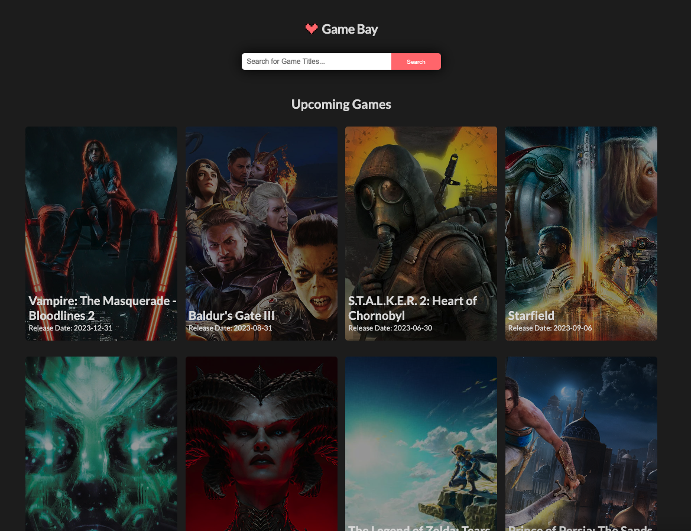

# Front-end Video games Info - with Framework

## Instructions

- You must create a web application that will display information about video games.
- You can use any framework you want, but we recommend using Angular or Vue.js.
- You can use SCSS or any other CSS preprocessor if you wish.
- The application must be responsive.
- Below are the requirements of the UI divided by page.
- In the "Required" category you will find the required features you need to include.
- In the "Optional" category you will find features that you could include if you have time.
- You can use all the available assets in any way you prefer.
- Finally, the organization of the code is your choice, there are no specifications. Ideally, you should optimize it for reusability and readability.

---

## Assets

Below you will find some information that will help you in the development of the application.

### Fonts

All texts in the application must use the Open Sans font which you will find [here](/assets/fonts/OpenSans).

### Colors

You can grab colors from the screenshot.

### API

you must get the data via HTTP requests.

You can use the following API to get the data you need or you can create your own mock data if you prefer or if the API doesn't work.

- `https://api.rawg.io/api` - requires an API key which you can get from [here](https://rawg.io/apidocs).

- Popular games URL - `${BASE_URL}games?key=${API_KEY}&dates=${lastYear},${currentDate}&ordering=-rating&page_size=10`

- Upcoming games URL - `${BASE_URL}games?key=${API_KEY}&dates=${currentDate},${nextYear}&ordering=-added&page_size=10`

- New games URL - `${BASE_URL}games?key=${API_KEY}&dates=${lastYear},${currentDate}&ordering=-released&page_size=10`

- Game details URL - `${BASE_URL}games/${gameId}?key=${API_KEY}`

- Game screenshots URL - `${BASE_URL}games/${gameId}/screenshots?key=${API_KEY}`

- Search game URL - `${BASE_URL}games?key=${API_KEY}&search=${gameName}&page_size=9`

### Images

- [Heart Logo](assets/images/heart-logo.svg)

---

## Required

### App Loader (spinner)

You must create a Loader (without any additional library, with the help of HTML/CSS).
The Loader will cover the entire page and fade out the content of the application.
When the necessary elements of the page are loaded, it must disappear, and the content of the application must be fully displayed.
Loader can have any shape you like.

### App

App must have the following sections in all pages:

- Header with the logo
- Footer with the logo, copyright section and current year

### Home page

Home page must include the following sections:

- A search bar
- Upcoming games
- Popular games
- New games

It must look like that:

## Search results page

Search results page must include the following sections:

- A search bar
- Search results

### Single game page

Single game page must include the following sections:

- A hero image of the game (cover)
- Game details
- Description
- A carousel of game screenshots

---

## Nice to have - Optional

### Save to Storage

Game lists must be saved on sessionStorage to avoid unnecessary requests to the API.

If the user refreshes the page, the data must be retrieved from the sessionStorage if available.

Search results are excluded.

### Favorites page

You can add a heart icon to each game card in the home page and search results page.

When the user clicks on the heart icon, the game must be added to the favorites page.

Favorite games must be saved on localStorage.

Favorites page must include the following sections:

- A list of the games that the user has added to favorites.

Favorites page can be linked from the header or anywhere you prefer. Use your imagination or research for best UX practices.

---

Enjoy the challenge! 🎮
